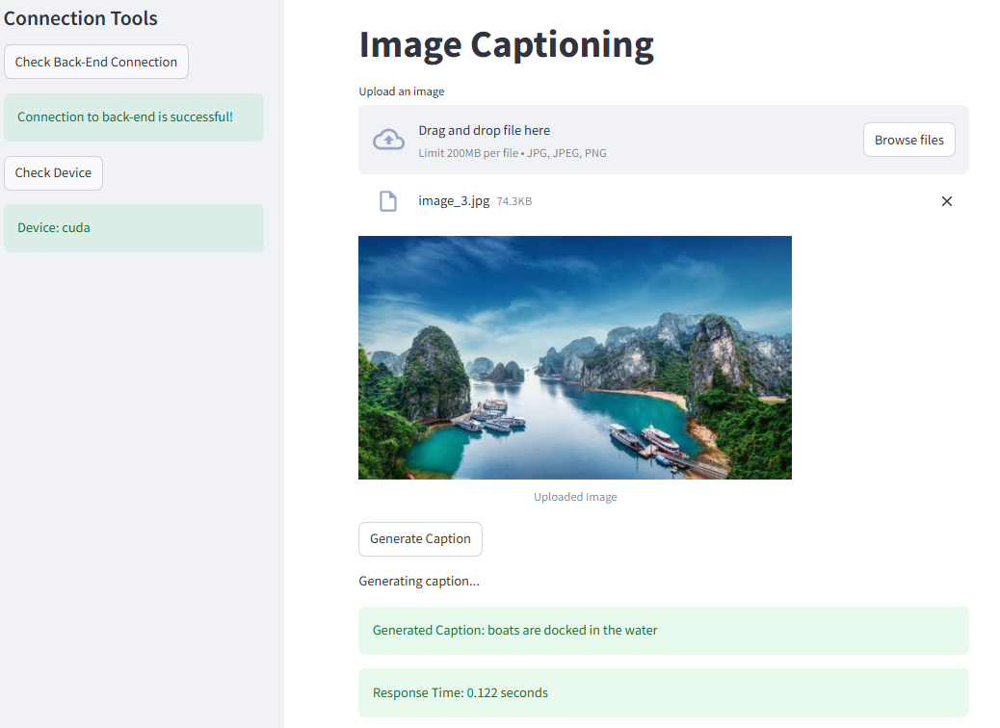

# **Image Captioning using ViT-GPT2 Deployed on Azure**

This project implements an **image captioning system** using the pre-trained **ViT-GPT2** model. The backend is built using **Flask**, and the frontend uses **Streamlit**. The application is deployed on **Microsoft Azure** with a Dockerized environment (including GPU support using NVIDIA Docker).

---

# **Table of Contents**
1. [Overview](#overview)
2. [Project Structure](#project-structure)
3. [How to Run the Project Locally](#how-to-run-the-project-locally)
4. [Deployment on Microsoft Azure](#deployment-on-microsoft-azure)
5. [Future Improvements](#future-improvements)
6. [License](#license)

---

## **1. Overview**

The system consists of:
- **Backend (Flask):** Serves the ViT-GPT2 model for inference.
- **Frontend (Streamlit):** a user-friendly interface for uploading images and displaying captions.
- **Dockerized Deployment:** packaging the application, including GPU support from Docker Container.
- **Microsoft Azure:** application is deployed as a containerized service for production use.





## **2. Project Structure**

```plaintext
project-root/
│
├── backend/                 
│   ├── app.py                    # Flask API server
│   ├── backend_utils.py          # Utility functions used in backend
│   ├── requirements.txt          # Backend dependencies
│   ├── Dockerfile                # Dockerfile for the backend 
|   ├── build_backend_docker.sh   # Script Docker build
|   ├── run_backend_docker.sh     # Script to run backend container
|   ├── run_backend_docker_gpu.sh     # Script to run backend container with GPU
|   ├── push_to_acr.sh        # Script to push Docker image to Azure Container Registry
|
├── frontend/                # Streamlit frontend for user interaction
│   ├── app.py               # Streamlit frontend code
│   ├── requirements.txt     # Frontend dependencies
│   ├── running_frontend.sh     # Script to run frontend
│
└── README.md                # Project documentation
```

---

## **3. How to Run the Project Locally**

#### **Prerequisites**
Ensure you have the following installed:
- Docker installed
- NVIDIA Docker Toolkit (for GPU support)
- Python 3.8 or higher
- Microsoft Azure CLI (optional, for deployment)

---

### **Step 1: Run the Backend (Flask)**
1. Build the backend Docker image:
   ```bash
   cd backend
   ./build_backend_docker
   ```

2. Run the backend container 

    Option 1: without GPU
    ```bash
    ./run_backend_docker
    ```

    Option 2: GPU support:
    ```bash
    ./run_backend_docker_gpu
    ```

The backend API will be available at `http://localhost:5000`.

---

### **Step 2: Run the Frontend (Streamlit)**
1. Install the dependencies:
   ```bash
   cd frontend
   pip install -r requirements.txt
   ```

2. Start the Streamlit application:
   ```bash
   ./running_frontend.sh
   ```

3. Visit `http://localhost:8501` to access the frontend.

---

## **4. Deployment on Microsoft Azure**

Follow these steps to deploy the project on Azure:

### **Step 1: Push the Docker Images to Azure Container Registry**
1. Log in to Azure:
   ```bash
   az login
   ```

2. Tag and push the Docker images:
    You just need to simply run the command:
   ```bash
   ./push_to_acr.sh
   ```

NOTE: remember to set up the Variables inside this file `push_to_acr.sh`

---

### **Step 2: Deploy the Backend to Azure**
1. Create a container instance:
   - You need to go to the Azure Container App to run your Docker Images.

2. Verify the deployment:
   - Access the Flask backend API using the generated DNS name or public IP.

---

## **5. Future Improvements**
- Training image captioning model in Vietnamese.
- Integrate NGINX for load balancing.
- Use Azure Kubernetes Service (AKS) for auto-scaling.
- Enable batch inference to improve throughput.

---

## **6. License**
This project is licensed under the **MIT License**. See [LICENSE](LICENSE) for details.

---

### **Contact**
For any questions or contributions:
- Website: https://nguyenthaivu.github.io/
- Let me know if you need help customizing it further! 🚀 